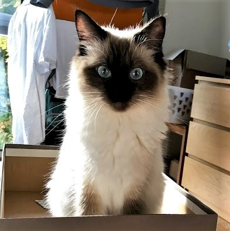

this is the index.md file

***test***  
- when using a jekyll theme --> only the index.md file will be rendered into the website  
- when not using jekyll --> the index.html file will be loaded into the website by default  

***hyperlink test***  
[test a hyperlink to my new subpage](page1/index.md)

***testing images***

      <b>testing a paragraph in html</b>   
            
            

**testing images in mardown**
- how can i center elements that have been added in markdown?
       
       
