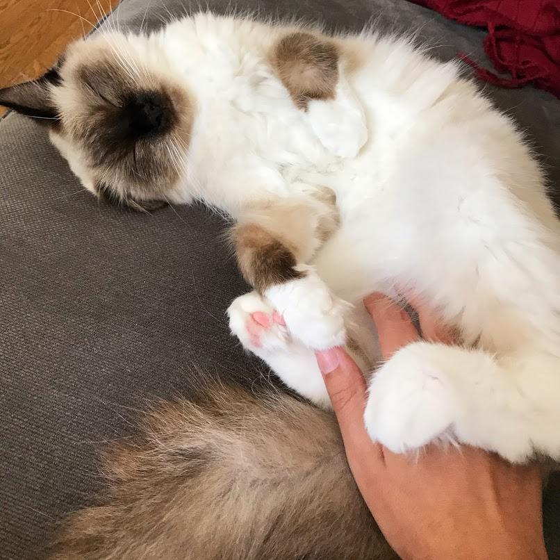

this is the index.md file

***test***  
- when using a jekyll theme --> only the index.md file will be rendered into the website  
- when not using jekyll --> the index.html file will be loaded into the website by default  

***hyperlink test***  
[test a hyperlink to my new subpage](page1/index.md)

***testing images***
- how can i center elements that have been added in markdown?
Note: Github markdown doesn't support alignment of images (see )
so the only way is to do it through direct html img tags. And for centering an image the only option is to put it inside a p tag and center it

      <b>testing a paragraph in html</b>   
            
            
            

